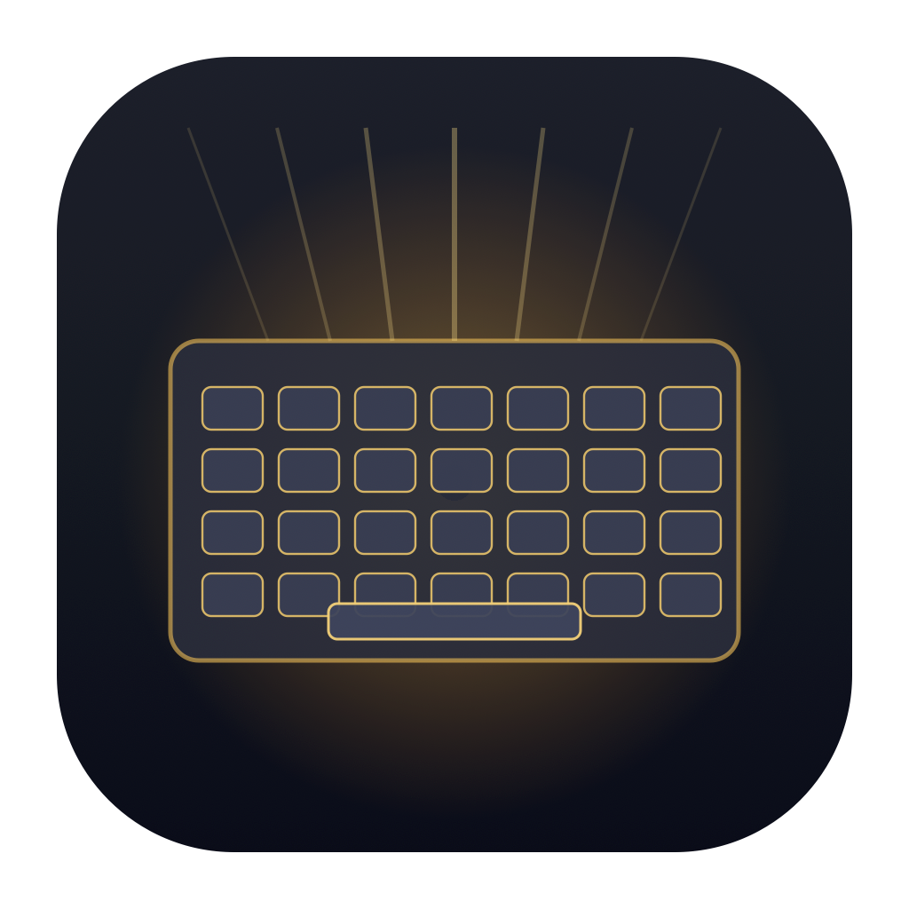

<div align="center">



# Lumos — Controle de Backlight do Teclado para MacBook

**Aplicativo nativo e ultraleve para macOS para controlar a iluminação do teclado do seu MacBook com precisão cirúrgica, atalhos físicos com OSD original, suporte à Touch Bar e economia inteligente de bateria.**


</div>

---

## ✨ Recursos

### 🎛️ 1. Barra de Menus (Menu Bar)
- **Discreto no Sistema:** Vive exclusivamente na barra superior do Mac, sem ocupar espaço no Dock (`LSUIElement`).
- **Ícone Dinâmico:** O ícone do menu reflete o status em tempo real da iluminação (desligado, baixa, média ou alta).
- **Porcentagem Opcional:** Permite exibir a porcentagem exata do brilho ao lado do ícone na barra de menus.
- **Painel Rápido (Popover):**
  - **Botão Power:** Liga e desliga a iluminação com 1 clique, memorizando o último nível ativo.
  - **Slider de Precisão:** Ajuste contínuo e suave de 0% a 100%.
  - **Presets Rápidos:** Botões de acesso imediato a `0%` (Desligado), `25%`, `50%`, `75%` e `100%` (Máximo).

### ⌨️ 2. Atalhos Físicos de Teclado & OSD Original do macOS
- **Teclas Físicas:** Controle o brilho pelas teclas nativas de iluminação (`F5` e `F6`) ou pelo atalho `Ctrl + Option + Setas Cima/Baixo`.
- **Ajuste Fino Micrométrico:** Pressione `Option + Shift` junto com as teclas de brilho para avançar em passos de 1/64 de nível.
- **Indicador Visual na Tela (OSD Bezel):** Exibe a janela translúcida original do macOS no centro da tela com os blocos (*chiclets*) subindo e descendo em tempo real.

### 🎚️ 3. Integração com a Touch Bar & Control Strip (MacBook Pro)
- **Atalho Permanente no Control Strip:** Botão dedicado no canto direito da Touch Bar, acessível mesmo ao usar outros aplicativos em tela cheia.
- **Controles Táteis Nativos:** Botões quadrados em AppKit puro (`SquareTouchBarButton`) com feedback visual imediato e slider tátil.
- **Sincronização com o Ciclo da Touch Bar:**
  - **Esmaecimento (~60s):** Diminui suavemente o brilho do teclado quando a Touch Bar esmaecer por inatividade.
  - **Repouso (~75s):** Apaga o teclado quando a Touch Bar desligar.
  - **Retorno Instantâneo:** Religa na hora ao tocar no teclado, no trackpad ou na Touch Bar.

### 🔋 4. Economia Inteligente de Bateria & Sensores Físicos
- **Sensor de Tampa Fechada (Clamshell Mode):** Monitora o sensor do MacBook via IOKit (`IOPMrootDomain`) para apagar a iluminação imediatamente ao fechar a tampa, evitando aquecimento interno e poupando bateria.
- **Repouso de Tela e do Sistema:** Apaga o backlight quando a tela desligar ou o computador entrar em repouso, restaurando o nível anterior ao despertar.
- **Temporizador de Inatividade (Auto-Dim):** Permite configurar um tempo de espera (15s, 30s, 1m, 2m, etc.) para reduzir ou apagar o brilho caso pare de digitar.

### ⚙️ 5. Janela de Ajustes Completa
- Janela independente com interface organizada em abas e seções.
- Indicadores visuais em tempo real do estado do hardware, da tela (*Tela ativa / desligada*) e da tampa (*Tampa aberta / fechada*).

---

## 💻 Compatibilidade

* **Sistema Operacional:** macOS 14.0 (Sonoma) ou superior.
* **Hardware Suportado:**
  * MacBooks com processadores **Apple Silicon** (M1, M2, M3, M4).
  * MacBooks com processadores **Intel** (incluindo modelos com **Touch Bar** e chip T2).

---

## 🚀 Como Executar

### Opção 1: Via Imagem de Disco (DMG)
1. Gere ou baixe o arquivo `Lumos.dmg`.
2. Dê um clique duplo para abrir a imagem de disco.
3. Arraste o ícone do **Lumos** para a pasta **Aplicativos** (`Applications`).
4. Abra o Lumos pelo Spotlight ou pelo Launchpad.

### Opção 2: Pelo Terminal
```bash
./build/Lumos.app/Contents/MacOS/Lumos &
```

> **Nota:** Para que os atalhos de teclado físicos (`F5`/`F6`) funcionem, conceda a permissão de **Acessibilidade** nas *Ajustes do Sistema > Privacidade e Segurança > Acessibilidade* quando solicitado.

---

## 🛠️ Compilação e Empacotamento

O projeto inclui scripts automatizados na pasta `scripts/`:

### 1. Compilar o aplicativo (.app)
Compila os arquivos Swift, inclui os metadados do bundle e assina localmente:
```bash
./scripts/build_app.sh
```
O executável final é gerado em: `build/Lumos.app`.

### 2. Gerar instalador em imagem de disco (.dmg)
Empacota o aplicativo compilado em um instalador DMG com o atalho de arrastar para `/Applications`:
```bash
./scripts/build_dmg.sh
```
Ou usando diretamente o `xcodebuild`:
```bash
./scripts/build_xcode_dmg.sh
```

### 3. Pelo Xcode
Abra o arquivo `Lumos.xcodeproj` no Xcode e pressione **Cmd + R** para executar ou **Cmd + B** para compilar. O esquema de compilação `Lumos` já está compartilhado.

---

## 🔬 Arquitetura Técnica

O Lumos se comunica com o hardware do teclado sem hacks ou dependências externas pesadas:
* **Comunicação IOKit HID:** Conecta-se diretamente aos dispositivos compatíveis via `IOHIDManager`.
* **Protocolo de 9 Bytes:** Envia relatórios de saída com Report ID `0x01` (`[0x01, UInt32(brightness), UInt32(duration)]`), operando na escala real do driver Apple (`0..512`).
* **Overlay Nativo (OSD):** Integração com a biblioteca interna `OSD.framework` do macOS para acionar os blocos visuais (*chiclets*) do sistema.
* **Control Strip:** Registro de elemento persistente na Touch Bar via `DFRFoundation`.

---

## 📄 Licença

Distribuído sob a licença MIT. Consulte o arquivo de licença para mais informações.
